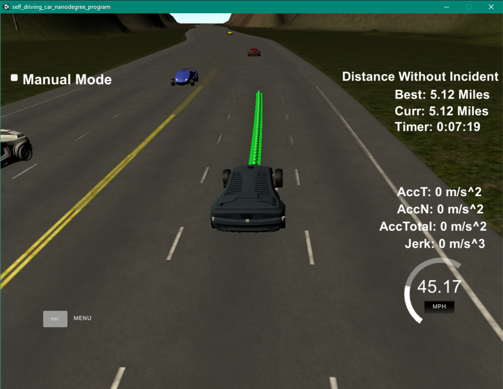
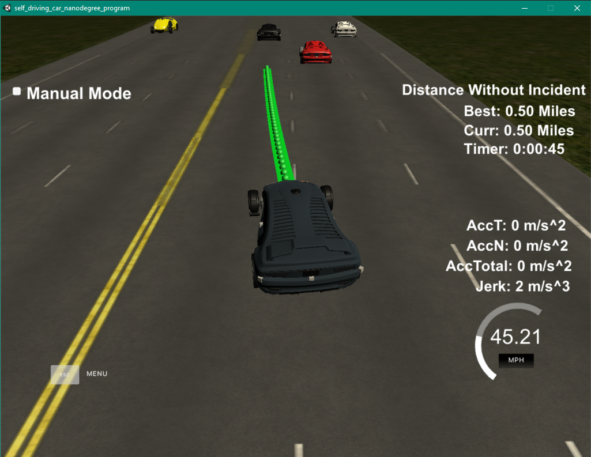

# Path Planning in Car Simulation

The goal of this project is to:
* create a path planning logic in C++
* build and run the program in the simulation
* keep the car below speed limit (50 mph), acceleration limit (10 m/s^2), and jerk limit (10 m/s^2)
* avoid any collision or accidents for at least 4.32 miles
* change lane when there is car in front and it's safe to change lane to either side

## Path Planning 

The car starts at a stop state, and it will keep accelerating until it reach around 5 mph below the speed limit or there is a vehicle in front of it. If there is a vehicle in front of it, the car will decelerate to keep a safe distance. The car will look to see if there is any vehicle in the left lane and right lane that is close to it by a certain distance. If not, the car will prioritize going left, but if it's not free, the car the change to right lane. 

## Path Generation

During the start, the path is generated from the position of the car. The next points are stored inside `ptsx` and `ptsy`. First I included the last datapoint of the previous position as the starting point of the new path. Then I found the next 3 waypoints which are 30 m apart, starting from the current position along the road. The planning is done in Frenet coordinate, then convert to XY coordinate before pushing into the data points storage. This is to provide smooth transition.

The `lane` variable is used to control the lane that we want to go. The car_d starts from 0, at the left lane line of the first lane, and end at 12, the right lane line of the 3rd lane. Giving that the lane is 4 meters apart, we can calculate the position of the center of each lane. By changing the lane, I can specify which lane I want to end up with.

The datapoints are then put into the spline object. The point in the spline are distance 30 meter apart. After I get the spline object points, I push those points into the `next_x_vals` and `next_y_vals`. 

## Result

The car is able to achive the goal of not having accidents for 4.32 miles and did not break any traffic law.

It is also able to change lane when there is car in front of it and is safe to swich to left or right lane.

